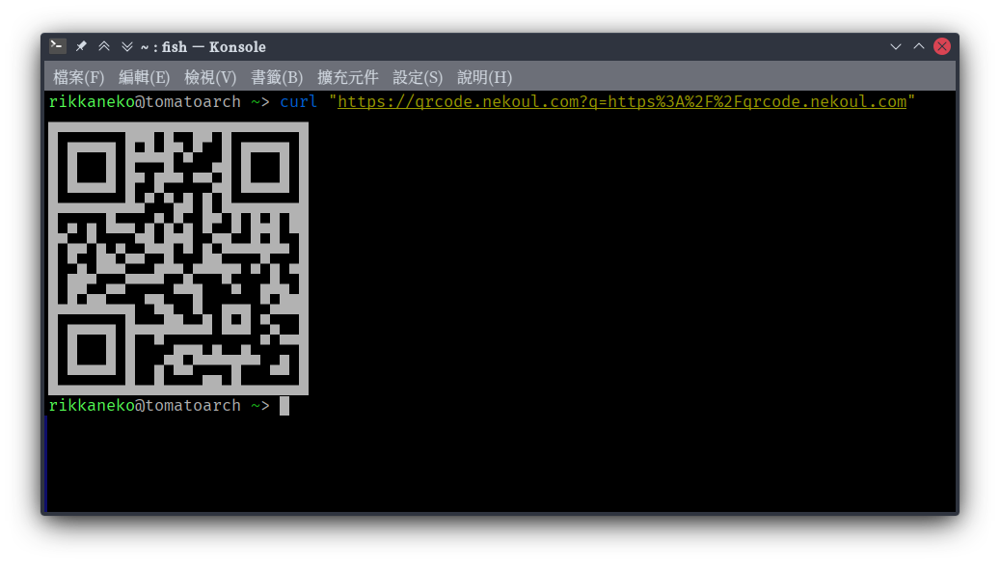

# qrcode-gen

This is a QR Code generation service targeted to run on Cloudflare workers.  
[qrcode.nekoul.com](https://qrcode.nekoul.com) is the current deployment of
this project.

## Usage

This application use query parameters to recieve input text and control the output format.  
| Parameters | Description |
|:-:|:-:|
| **q** | Text to encode   *URL-encoded string* |
| **type** | Output format   (Available options: `svg` and `utf8`) |

The output format is default to `utf8`.  
If used `svg`, a QR code of SVG format would be served with proper `Content-Type` header set.  
If used `utf8`, a QR code formatted with UTF-8 characters would be generated.

## Example

Testing string: **https://qrcode.nekoul.com**

### **<u>UTF-8</u>**

### **<u>SVG</u>**

